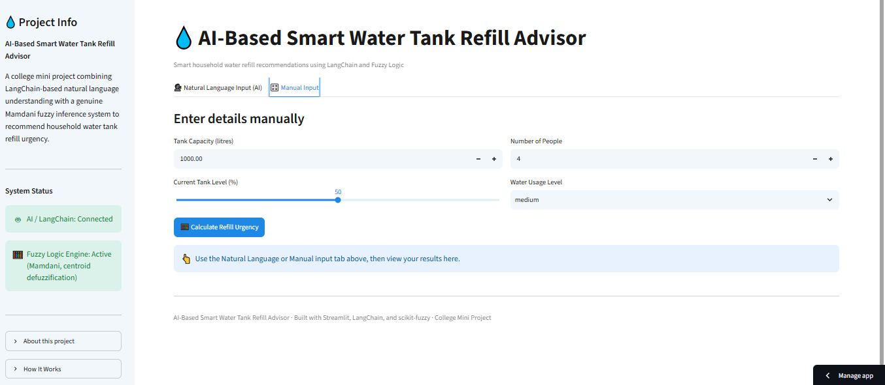
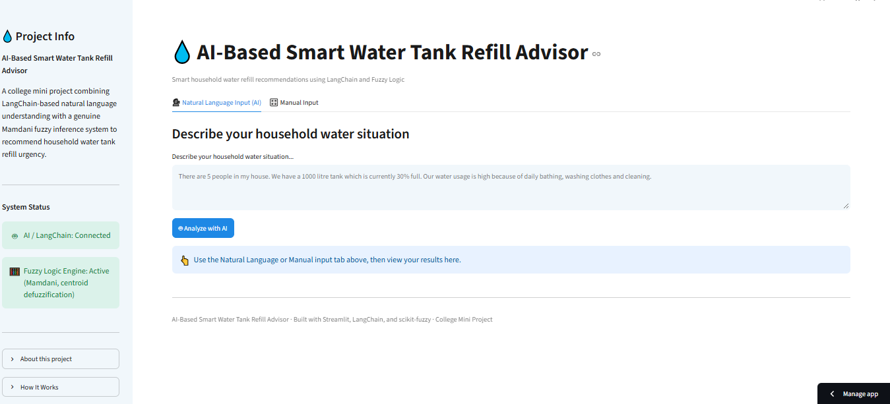
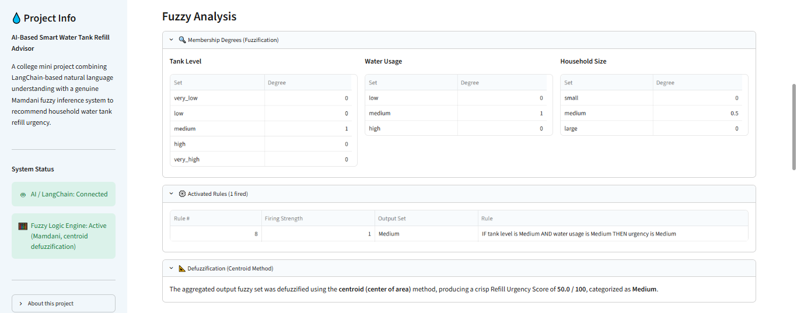
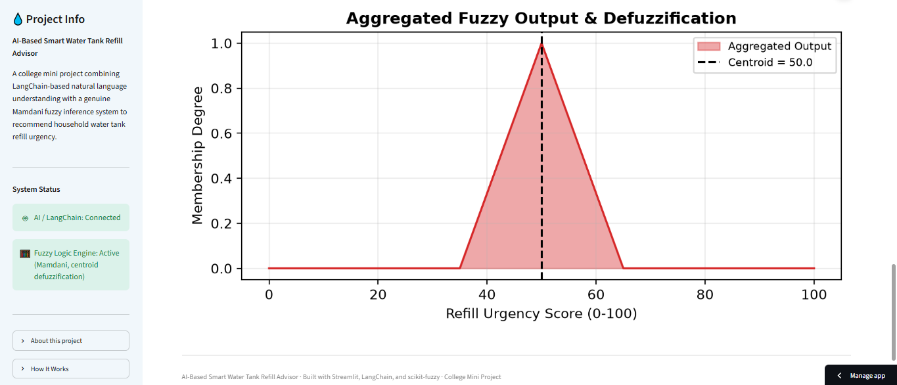
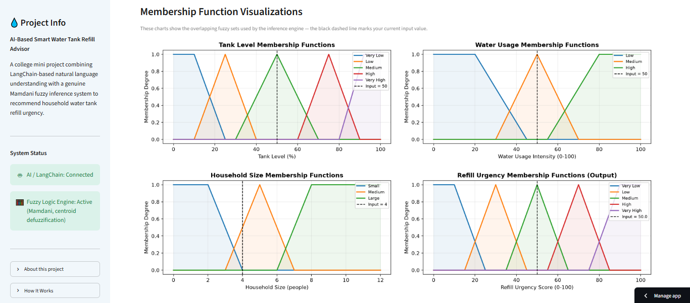
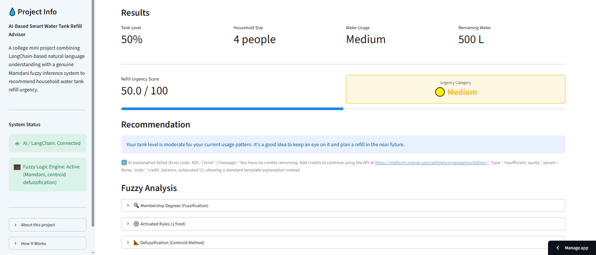

# 💧 AI-Based Smart Water Tank Refill Advisor

### Smart household water refill recommendations using LangChain and Fuzzy Logic

**AI-Based Smart Water Tank Refill Advisor** is a web-based college mini project that helps households determine how urgently their water tank needs to be refilled.

The system supports both **manual input** and **natural-language input**. Natural-language input is processed using **LangChain and OpenAI**, while the actual refill urgency is calculated using a **Mamdani Fuzzy Logic** inference system.

The fuzzy logic engine generates the numeric urgency score, while LangChain is used for natural-language information extraction and AI-generated explanations.

---

## 🚀 Main Features

- 🗣️ **Natural Language Input**
- 🎛️ **Manual Input Mode**
- 🧮 **Mamdani Fuzzy Logic-based Urgency Calculation**
- 📊 **Refill Urgency Score from 0–100**
- 📈 **Very Low, Low, Medium, High and Very High Categories**
- 🔍 **Fuzzy Analysis**
- 📊 **Membership Function Visualizations**
- 🤖 **AI-generated Recommendations using LangChain**
- 🛡️ **Input Validation**
- 📱 **Mobile-Friendly Streamlit Interface**

### 🧮 Mamdani Fuzzy Logic

The project implements a five-stage Mamdani fuzzy inference process:

1. Fuzzification
2. Rule Evaluation
3. Implication
4. Aggregation
5. Centroid Defuzzification

### 🔍 Fuzzy Analysis

The application displays:

- Membership degrees
- Activated fuzzy rules
- Rule firing strengths
- Fuzzy output analysis

### 📈 Membership Function Visualization

The application provides membership function visualizations for:

- Tank Level
- Water Usage
- Household Size
- Refill Urgency

---

## 🛠️ Technologies / Tech Stack

| Category | Technology |
|---|---|
| Programming Language | Python 3.10+ |
| Web Framework | Streamlit |
| AI / LLM Orchestration | LangChain |
| LLM Provider | OpenAI |
| LLM Model | GPT-4o-mini |
| Fuzzy Logic | scikit-fuzzy |
| Data Validation | Pydantic |
| Visualization | Matplotlib |
| Data Handling | Pandas, NumPy |
| Deployment | Streamlit Community Cloud |
| Version Control | Git & GitHub |

---

## 🧠 How It Works

```text
                         USER INPUT
                              │
              ┌───────────────┴───────────────┐
              │                               │
              ▼                               ▼
     Natural Language Input            Manual Input
              │                               │
              ▼                               │
       LangChain Extraction                   │
              │                               │
              ▼                               │
       Structured Information                 │
              │                               │
              └───────────────┬───────────────┘
                              ▼
                     Input Validation
                              │
                              ▼
                  Mamdani Fuzzy Inference
                              │
              ┌───────────────┼───────────────┐
              │               │               │
              ▼               ▼               ▼
        Fuzzification   Rule Evaluation   Implication
              │               │               │
              └───────────────┼───────────────┘
                              ▼
                         Aggregation
                              │
                              ▼
                  Centroid Defuzzification
                              │
                              ▼
                    Refill Urgency Score
                           0 – 100
                              │
                              ▼
                     Urgency Category
                              │
                              ▼
                    AI Recommendation
                              │
                              ▼
                       FINAL RESULT
```

The **fuzzy logic engine** is responsible for calculating the actual numeric refill urgency score.

LangChain is used for:

- Natural-language information extraction
- AI-generated explanation and recommendation

The LLM does not modify or override the fuzzy logic score.

---

## ⚙️ Installation & Setup

### 1. Clone the Repository

```bash
git clone https://github.com/<your-username>/smart-water-tank-refill-advisor.git
```

### 2. Navigate to the Project Directory

```bash
cd smart-water-tank-refill-advisor
```

### 3. Create a Virtual Environment

#### Windows

```bash
python -m venv venv
venv\Scripts\activate
```

#### macOS / Linux

```bash
python3 -m venv venv
source venv/bin/activate
```

### 4. Install Dependencies

```bash
pip install -r requirements.txt
```

---

## 🔐 Environment Variables

The project uses an OpenAI API key for natural-language extraction and AI-generated explanations.

Create a `.env` file using `.env.example`.

```env
OPENAI_API_KEY=your_openai_api_key_here
```

For Streamlit Community Cloud:

```toml
OPENAI_API_KEY = "your_openai_api_key_here"
```

> **Important:** Never upload your actual API key to GitHub.

Add `.env` to `.gitignore`:

```text
.env
```

---

## ▶️ How to Run the Project

From the project root directory, run:

```bash
streamlit run app.py
```

The application will normally be available at:

```text
http://localhost:8501
```

Open the URL in your web browser.

---

## 🧪 How to Use the Project

### Step 1 — Select Input Mode

The application provides two input options:

```text
Manual Input
Natural Language Input
```

---

### Step 2 — Manual Input

Enter the following information:

- Tank capacity
- Current tank level
- Household size
- Water usage

Submit the information to calculate the refill urgency.

The fuzzy inference engine then calculates:

- Refill urgency score
- Urgency category
- Fuzzy analysis
- Recommendation

Manual input works without an OpenAI API key.

---

### Step 3 — Natural Language Input

Select **Natural Language Input** and describe the household water situation in plain English.

Example:

```text
There are 5 people in my house.
The tank capacity is 1000 litres and it is around 30% full.
We use a lot of water for bathing, washing clothes and cleaning.
```

LangChain extracts the required information and validates it before sending the data to the fuzzy inference engine.

The system then calculates the urgency score and generates an AI-based explanation.

---

## 📸 Screenshots

### 🎛️ Manual Input

<p align="center">
  
</p>

### 🗣️ Natural Language Input

<p align="center">
  
</p>

### 🔍 Fuzzy Analysis

<p align="center">
  
</p>

### 📊 Fuzzy Output

<p align="center">
  
</p>

### 📈 Membership Function Visualization

<p align="center">
  
</p>

### 📋 Final Results

<p align="center">
  
</p>

---

## 🌐 Live Deployment

🚀 **Try the AI-Based Smart Water Tank Refill Advisor Online:**

https://smart-water-tank-refill-advisor-jjq84sm7torpoayc7huetm.streamlit.app/

> The application is deployed using **Streamlit Community Cloud**.

---

## 👨‍🎓 Student Details

| Information | Details |
|---|---|
| **Name** | RAJESH GAIKWAD |
| **Roll No.** | 19011 |
| **Course** | B.Sc. Information Technology |
| **Project Type** | College Mini Project |
| **Project Title** | AI-Based Smart Water Tank Refill Advisor |

---

## ⭐ AI-Based Smart Water Tank Refill Advisor

**Smart water refill recommendations using AI and Fuzzy Logic.**
